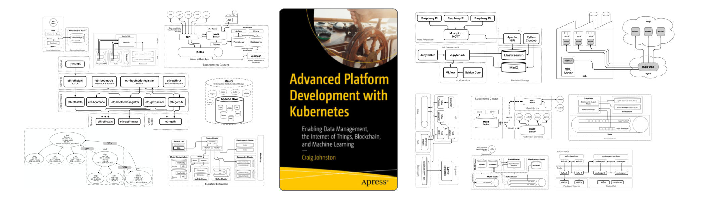

# Chapter 8: Data Warehouses

## Listings

- [Listing 8-1: MySQL operator Namespace](/chapter-08/cluster-apk8s-dev5/000-cluster/25-mysql-operator/00-namespace.yml)
- [Listing 8-2: MySQL cluster configuration](/chapter-08/cluster-apk8s-dev5/003-data/080-mysql/90-cluster.yml)
- [Listing 8-3: Rook Cassandra operator](/chapter-08/cluster-apk8s-dev5/000-cluster/23-rook-cassandra/00-operator.yml)
- [Listing 8-4: Rook Cassandra RBAC configuration](/chapter-08/cluster-apk8s-dev5/003-data/060-cassandra/15-rbac.yml)
- [Listing 8-5: Rook Cassandra cluster configuration](/chapter-08/cluster-apk8s-dev5/003-data/060-cassandra/90-cluster.yml)
- [Listing 8-6: Apache Hive configuration template `hive-site-template.xml`](/chapter-08/hive/hive-site-template.xml)
- [Listing 8-7: Apache Hive container `entrypoint.sh` script](/chapter-08/hive/entrypoint.sh)
- [Listing 8-8: Apache Hive `Dockerfile`](/chapter-08/hive/Dockerfile)<!-- @IGNORE PREVIOUS: link -->
- [Listing 8-10: Apache Hive `docker-compose.yml`](/chapter-08/hive/docker-compose.yml)
- [Listing 8-11: Apache Hive Service](/chapter-08/cluster-apk8s-dev5/003-data/085-hive/10-service.yml)
- [Listing 8-12: Apache Hive Deployment](/chapter-08/cluster-apk8s-dev5/003-data/085-hive/30-deployment.yml)
- [Listing 8-13: Presto Helm configuration](/chapter-08/cluster-apk8s-dev5/003-data/095-presto/values.yml)
- [Listing 8-14: Presto Ingress](/chapter-08/cluster-apk8s-dev5/003-data/095-presto/50-ingress.yml)

